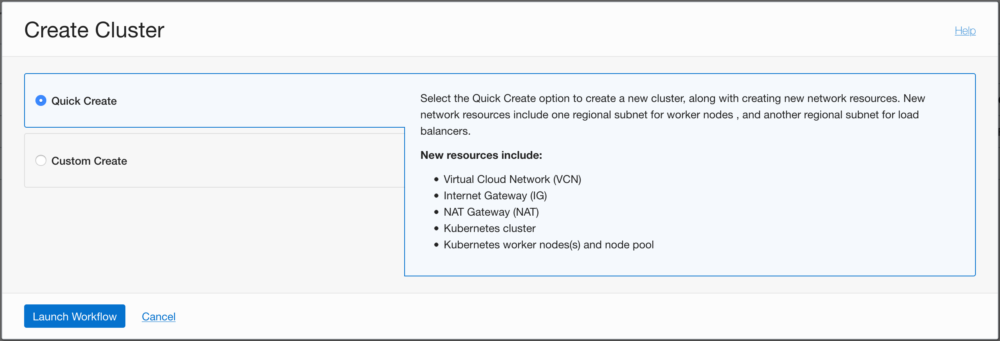
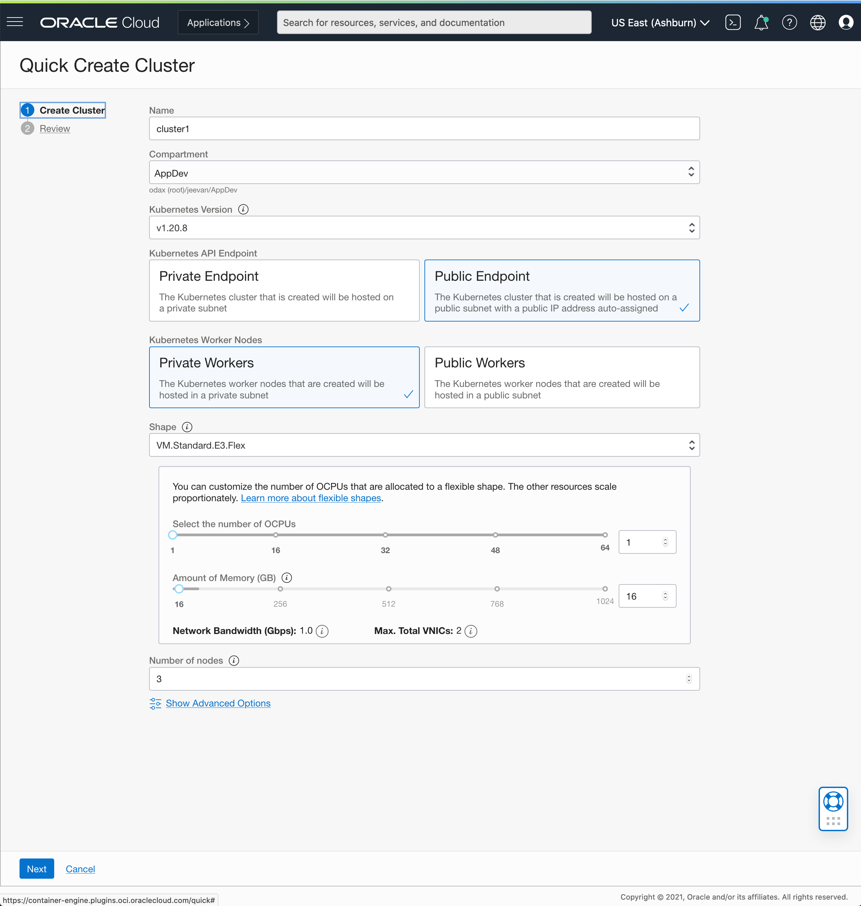
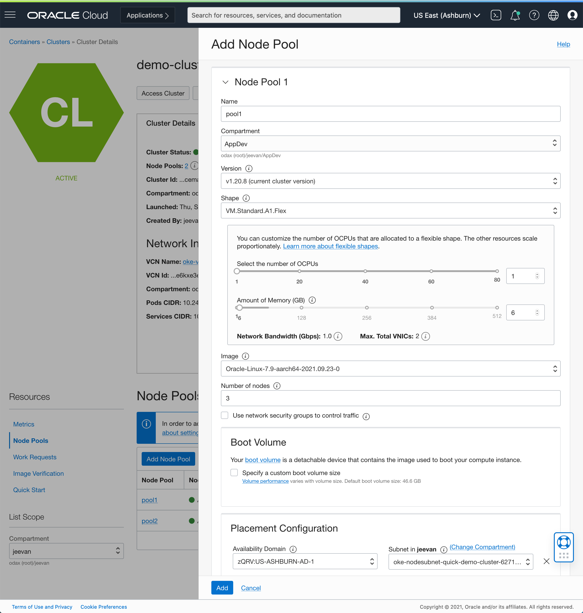
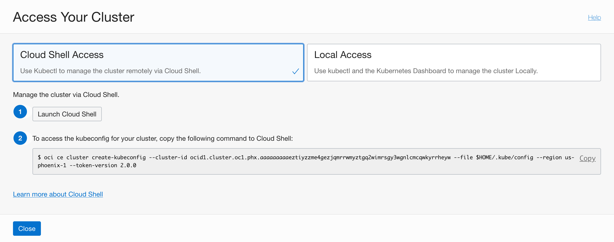

# Get started with Arm-based Kubernetes clusters in Oracle Cloud Infrastructure

This tutorial explains how to create Arm-based Kubernetes clusters that use the Ampere A1 compute platform in Oracle Cloud Infrastructure(OCI). You will also deploy the popular web container, Apache Tomcat on the kubernetes cluster. Using the methods in this tutorial, you can create application deployments that are seamlessly portable between the Arm-based kubernetes clusters and x86(Intel and AMD) based clusters. 

## Introduction

### Objectives

In this tutorial, you will:

* Create a Kubernetes cluster (OKE) powered by both x86 nodes and Arm based nodes.
* Deploy Apache Tomcat to the cluster.
* Create deployments that are seamlessly portable across x86 and Arm based nodes in a kubernetes cluster.  
* Deploy Java applications and micro services to the Tomcat web container.  

## What is the Ampere A1 Compute Platform

The Ampere A1 compute platform based on Ampere Altra CPUs represent a generational shift for enterprises and application developers that are building workloads that can scale from edge devices to cloud data centers. The unique design of this  platform delivers consistent and predictable performance as there are no resource contention within a compute core and offers more isolation and security. This new class of compute shapes on Oracle Cloud Infrastructure  provide an unmatched platform that combines power of the Altra CPUs with the security, scalability and eco-system of services on OCI.

## Introducing the Arm Architecture to your Environment

When introducing the Arm architecture to your application development process, your development workflows stay the same in most cases. The tools and the process that you currently use will carry over seamlessly, and your development workstation setup will remain the same. The general exception to this is low-level system applications that target specific CPU features using highly specialized tools.  In most cases, you might expect minor changes to the build or packaging steps in your workflow, to support the Arm architecture. Start by analyzing your existing workflow to identify if you have any platform-specific build or packaging steps. 

 - Platform-specific build steps can be compiler options, in the case of compiled languages like [C/C++](https://developer.amperecomputing.com/), [Go](https://github.com/golang/go/wiki/GoArm), and [Rust](https://doc.rust-lang.org/nightly/rustc/platform-support.html). In these cases, you typically add a build step to compile your application for Arm along with the x86 version of the application. If you're using a bytecode language, Just-In-Time (JIT) compiled language, or an interpreted language such as Java, JavaScript, TypeScript, Python, or Ruby, then there are usually no compile-time flags or options. These languages don't produce platform-specific executable binaries; instead, they use a platform-specific runtime, such as the Java or Node.js runtime for Arm, which runs the same source code across multiple platforms.
 - Platform-specific packaging includes packaging your applications as Docker images, custom VM images, or platform-specific deployment artifacts. In these cases, you will want to amend your build process with an additional step to produce the application package that is Arm specific. In the case of container images, for example, you will want to have a version of your application image that is for deployment on an Arm system. Container image formats support multiple architectures, so that the container runtimes of each platform can simply fetch the appropriate image and run the application. See the Docker blog to learn more about [multi-arch images](https://www.docker.com/blog/getting-started-with-docker-for-arm-on-linux/) and [how to build them](https://www.docker.com/blog/multi-arch-images/).

## Create an Arm-based Kubernetes Cluster

Container Engine for Kubernetes is easy to start using, and combined with OCI Cloud Shell, you can have complete control without having to set up a local environment. To get started, you create a new Kubernetes cluster on OCI.

1. From the navigation menu in the Oracle Cloud Console, go to **Developer Services** and click **Kubernetes Clusters**.

2. Click **Create Cluster**. You can use the **Quick Create** option to use default values or the **Custom Create** option to specify advanced settings. Here we use the **Quick Create** because the defaults that it chooses are a great start.

   
   [Description of illustration create cluster](image_description/02_create_cluster.txt " ")

3. On the Create Cluster page, choose some basic configuration options, like the version of Kubernetes that you want to run and the number and shape of the nodes for your cluster. For this tutorial, choose the E3.Flex or E4.Flex shapes to start with. These are based on x86 CPUs from AMD's EPYC line. We will add Arm shapes to the cluster shortly.  

   **Note** You can also choose the `VM.Standard.A1.Flex` shape for the nodes at this point, and add the x86 nodes later. The order does not matter.

   
   [Description of illustration create workflow](image_description/03_create_workflow.txt " ")

   You can also specify a name and compartment for the cluster. The visibility type indicates whether the nodes in the cluster are reachable from the internet, for example, over SSH. It's more common to keep them on a private network and use bastion or jump hosts on the public network to provide access paths. Here we choose the default of keeping the nodes private.

4. Click **Create Cluster** and the workflow starts creating all the required required resources and the cluster itself. 

   After the supporting resources are created, the cluster details page is displayed. Within a few minutes, the cluster is created and activated.

5. Once the cluster is active, we can add a second NodePool, with Arm based nodes (or x86 if you chose Arm initially). Navigate to 'Node Pools' on the side navigation bar, and click on 'Node Pool'. Select the shape and where to place the nodes. When choosing the subnet, ensure that you choose the "nodesubnet" that was created for you by the workflow. 

   **Note** We are keeping the network topology simple here, but other topologies are possible as well.
   
   [Description of illustration create workflow](image_description/03_create_workflow.txt " ")

5. Drilling in to the Node Pools, you can check the status of the Nodes. After the nodes are Active, click the **Access Cluster** button to see the ways to access the cluster.

6. Choose the Cloud Shell option. Cloud Shell is a full-featured, online terminal environment integrated with the Console. Cloud Shell has all the tools you need for interacting with your Kubernetes cluster and is the quickest way to get started without configuring a local development environment.

   
   [Description of illustration access cloudshell ](image_description/06_access_cloudshell.txt " ")

   You can launch Cloud Shell directly from the page. Note that access to Cloud Shell is also available on the top of the Console at all times, for quick access.

   The page also include a command to run inside Cloud Shell. This command uses the OCI CLI to create the *kubeconfig* file. Kubernetes clients like `kubectl` can work with a configuration file that facilitates access to the cluster. Such a file is generally called a *kubeconfig* file. Typically, this configuration file resides in *~/.kube*. A single configuration file can contain access configuration for multiple clusters.

   **Note** OCI CLI is already installed and configured for you in the Cloud Shell environment. 

7. Launch Cloud Shell, and then copy the command and paste it in to Cloud Shell to run it. The standard command line client for Kubernetes is kubectl and it is preinstalled in the Cloud Shell environment. 
   
   Now, let's check if we can interact with the cluster and see the cluster nodes. 

8. Copy the following command to Cloud Shell and run it.
   
    ```
    kubectl get nodes -o wide
    ```
   You should see output similar to the following example, depending on the number of nodes in the cluster. Note the kernel version shows that we are running Oracle Linux for `aarch64` (Arm 64-bit) architecture. 

    ```
    NAME          STATUS   ROLES   AGE     VERSION   INTERNAL-IP   EXTERNAL-IP   OS-IMAGE                  KERNEL-VERSION                       CONTAINER-RUNTIME
    10.0.10.11    Ready    node    5d23h   v1.20.8   10.0.10.11    <none>        Oracle Linux Server 7.9   5.4.17-2102.204.4.4.el7uek.aarch64   cri-o://1.20.2
    10.0.10.161   Ready    node    5d23h   v1.20.8   10.0.10.161   <none>        Oracle Linux Server 7.9   5.4.17-2102.204.4.4.el7uek.x86_64    cri-o://1.20.2
    10.0.10.19    Ready    node    5d23h   v1.20.8   10.0.10.19    <none>        Oracle Linux Server 7.9   5.4.17-2102.204.4.4.el7uek.aarch64   cri-o://1.20.2
    10.0.10.190   Ready    node    5d23h   v1.20.8   10.0.10.190   <none>        Oracle Linux Server 7.9   5.4.17-2102.204.4.4.el7uek.x86_64    cri-o://1.20.2
    10.0.10.243   Ready    node    5d23h   v1.20.8   10.0.10.243   <none>        Oracle Linux Server 7.9   5.4.17-2102.204.4.4.el7uek.aarch64   cri-o://1.20.2
    10.0.10.42    Ready    node    5d23h   v1.20.8   10.0.10.42    <none>        Oracle Linux Server 7.9   5.4.17-2102.204.4.4.el7uek.x86_64    cri-o://1.20.2
    ```

   Now that you have a fully functioning Kubernetes cluster and have set up the tools to interact with it, you can deploy any kubernetes workload to it. 

## Seamless Deployments to your Kubernetes Clusters

You can now deploy containerized workloads to your Arm based kubernetes cluster. Container images are built for specific architectures. Container tools such as Docker or Buildah provide the methods to manage these images and their deployment seamlessly. In this example, you will deploy Apache Tomcat, the popular Java web container to the kubernetes cluster. The docker runtime will fetch the `arm64v8` image when running on Arm and the `amd64` image when running on x86 architectures. This enables us to create seamlessly portable kubernetes deployment manifests as long as we build the application images for both architectures. 

When transitioning to Arm in the datacenter, often teams will want to slowly introduce the architecture to their workloads. A typical journey for a team would be to start with a second cluster and deploy non-critical workloads like seasonal workloads, or to introduce an Arm basd ode pool the cluster, but pin the critical workloads to x86 at first and run non-critical workloads on the Arm nodes. Then teams can slowly transition to running a mix of both x86 and Arm nodes, and finally taper off the x86 nodes when the team is operationally comfortable to do so. 

The kubernetes cluster adds labels to the nodes by default and while these labels are free form key value pairs, kubernetes project identifies a set of standard or [well known labels](https://kubernetes.io/docs/reference/labels-annotations-taints/) that include the `kubernetes.io/arch` label that identifies node's CPU architecture (e.g. `kubernetes.io/arch=arm64`). The cluster we created also has these labels, which can be displayed with the command below.

```
kubectl get nodes -o json |jq '.items[] | {name:.metadata.name, labels:.metadata.labels}'

kubectl get nodes -o json | jq -r '.items | sort_by(.spec.nodeName)[] | [.metadata.name, .metadata.labels."kubernetes.io/arch"] | @tsv'
```

Start by creating a deployment manifest. The manifest should not refer to any architecture specific containers, as the container runtime is capable of detecting the correct architecture and pulling the appropriate image. To create the manifest, runs the commend below. It creates a new file named `tomcat.yaml`.

```
cat <<EOF > tomcat.yaml
apiVersion: apps/v1
kind: Deployment
metadata:
  name: tomcat
  labels:
    app: tomcat
spec:
  replicas: 6
  selector:
    matchLabels:
      app: tomcat
  template:
    metadata:
      labels:
        app: tomcat
    spec:
      topologySpreadConstraints:
      - maxSkew: 1
        topologyKey: kubernetes.io/arch
        whenUnsatisfiable: DoNotSchedule
        labelSelector:
          matchLabels:
            app: wordpress
      containers:
        - name: tomcat
          image: tomcat:9
          ports:
            - containerPort: 8080
          volumeMounts:
            - name: app-volume
              mountPath: /usr/local/tomcat/webapps/
      volumes:
        - name: app-volume
          configMap:
            name: app-bundle  
---
apiVersion: v1
kind: Service
metadata:
  name: tomcat
  labels:
    app: tomcat
spec:
  ports:
  - port: 80
    name: http
    targetPort: 8080
  selector:
    app: tomcat
  type: LoadBalancer
EOF

```

      
	  
This manifest contains the following objects and actions :

  - A deployment object with the name `tomcat` and label `app: tomcat`. 
  - The Pod has a `nodeSelector` that selects nodes that match `kubernetes.io/arch: arm64`
  - The deployment has 3 replicas.
  - The pods in the deployment have a single container - `tomcat:9`. Note that the manifest does not specify the architecture, making it valid across all architectures. Docker will pull the image that supports the appropriate architecture at runtime. 
  - A *Volume* object is created from a *ConfigMap*, and mounted in to the container. This ConfigMap will be created later, and will contain the application.
  - The manifest also contains a Service object, and exposes the deployment over a LoadBalancer. 

1. Download the sample application for Apache Tomcat and create it as a ConfigMap. 
    
	 ```
    wget https://tomcat.apache.org/tomcat-9.0-doc/appdev/sample/sample.war
    kubectl create configmap app-bundle --from-file sample.war
    ```
    **Note** This method of mounting an application using a *ConfigMap* is for convenience only, and should not be used in production applications.

2. Deploy the manifest. This creates the kubernetes objects, including the Deployment and the Service. When creating the deployment the docker runtime will detect its running on teh arm architecture and automatically pick the Arm variant of the Apache Tomcat container. The Java application deployed on the container, is platform neutral and hence the same `.war` file can be deployed across all architectures.
    
      ```
      kubectl apply -f tomcat.yaml
      ```

3. Check your deployment status 
    
      ```
      kubectl get deploy,svc,po
      ```
    You should see output similar to the following
      ```
      NAME                          READY   STATUS    RESTARTS   AGE
      pod/tomcat-68c489fdfd-4xbxp   1/1     Running   0          144m
      pod/tomcat-68c489fdfd-78xjd   1/1     Running   0          144m
      pod/tomcat-68c489fdfd-gwr9w   1/1     Running   0          144m

      NAME                     READY   UP-TO-DATE   AVAILABLE   AGE
      deployment.apps/tomcat   3/3     3            3           145m

      NAME                 TYPE           CLUSTER-IP     EXTERNAL-IP      PORT(S)        AGE
      service/kubernetes   ClusterIP      10.96.0.1      <none>           443/TCP        6d4h
      service/tomcat       LoadBalancer   10.96.90.168   132.226.33.129   80:30558/TCP   144m
      ```
   Once the Public IP is available, you will be able to navigate to http://<EXTERNAL-IP>/sample/ to view the application we deployed.  

   This shows that Tomcat has been deployed successfully on our Arm based kubernetes cluster and is serving a Java web application. The deployment manifest we used is not tied to the architecture, and can be used for x86 as well as Arm based clusters. 

4. You can optionally get detailed node level details by running  

      ```
      kubectl get nodes -o wide
      kubectl describe node <node_name>
      ```
   Detailed information about the node, including the architecture and the pods that are scheduled on that node are displayed.
   You can also find which nodes your pods are running on and what architecture they use.
      ```
      kubectl get pods -o json | jq -r '.items | sort_by(.status.hostIP)[]|[.spec.containers[].image,.status.phase,.spec.nodeName,.spec.nodeSelector."kubernetes.io/arch",.status.containerStatuses[].imageID]|@tsv'
      ```

   When the external IP address for the LoadBalancer is available (this could take a couple of minutes) you can visit the deployment by pointing your web browser to `http://<your_loadbalancer_ip_address>/sample`

5. Now we can move beyond a clinical example and deploy a popular open source project - WordPress. 
   You can clone this repository to get the source files - 
   ```
    git clone https://github.com/jeevanjoseph/kubernetes-on-arm.git && cd kubernetes-on-arm 
   ```
   We can examine the manifest files - note that we are not pinning the deployments to any particular CPU architecture here, but you can. 
   Deploy with 
   ```
   kubectl apply -k ./manifests
   ```
   check the deployment status with `kubectl get deploy,po,svc,pv,pvc`


## Next Steps

Explore more workloads you can deploy on your Arm based kubernetes cluster by visiting the docker hub repository of the official `arm64v8` images [here](https://hub.docker.com/u/arm64v8)


